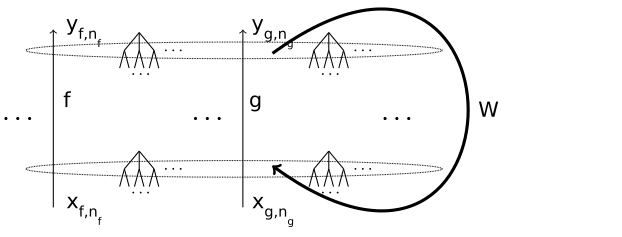
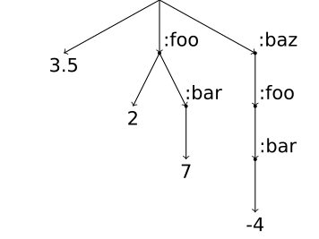

# Basics of self-modifying neural machines

Neural machines work by repeating a two-stroke cycle. 
The inner mechanisms of neurons work during the first phase of the cycle.
Then the network connectivity matrix remixes the neuron outputs with weights
and creates neuron inputs for the next cycle during the second phase of the cycle.

To allow the neural machine to modify its own connectivity matrix,
we create a dedicated neuron _Self_ which emits a new network connectivity matrix on each step
during the first phase of each cycle
(or it might emit a more complex structure which contains the connectivity matrix).
This newly created connectivity matrix is used during the second phase of the same cycle.

The newly created connectivity matrix is just one of the neuron outputs, so
along with other neuron outputs it gets remixed during the second phase (yes, this is
an example of self-application) to create neuron inputs for the next cycle.

This allows the network to analyze its own connectivity and to use its own
connectivity structure in various ways, in addition to using it directly
during the second phase of a two-stroke cycle.

### _Self_ is typically an accumulator

We usually connect the output of _Self_ containing the connectivity matrix with one of
its inputs with weight 1. This way _Self_ accumulates the connectivity matrix while
accepting updates to its value from other neurons in the network.

This is not mandatory, one can imagine different arrangements. But this is how we
were doing things in our 2016-2018 experiments.

### Unlimited dynamic self-expansion

In some of our experiments we allowed unlimited dynamics self-expansion of the network.

To do this one imagines having "an ambient infinite collection of silent neurons
which don't take any memory or computational resources, but only exist as abstract
entities in the infinite address space". Under this approach, the connectivity matrix
is infinite, but it contains only a finite number of non-zero elements (so this is
an inherently sparse matrix).

When a neuron acquires a non-zero connection within the connectivity matrix,
this neuron stops being silent and is no longer just an abstract entity, but
it gets allocated in the memory, and computational resources are now spent on
computing its inputs and outputs. Such neuron is called _active_.

# A simple scenario for self-expansion

We start with two active neurons and with the connectivity matrix containing
two non-zero elements.

One of this active neurons is _Self_, and one of the two non-zero elements
of the connectivity matrix is weight 1, connecting the output of _Self_ to one of its inputs.

Another active neuron is _Update_, and the second non-zero element of
the connectivity matrix is weight 1, connecting the output of _Update_
to one of the inputs of _Self_.

During the first phase of the two-stroke cycle, _Self_ combines its inputs
together creating a new connectivity matrix.

What is happening under this scenario depends on the specific
updates to the connectivity matrix emitted by the neuron _Update_.

When the connectivity matrix emitted by _Self_ contains new non-zero
elements, more neurons become active as necessary.

### Live-coding scenario

In the livecoding scenario, the _Update_ neuron listens for matrix
updates on an asynchronous channel. If it does not hear anything,
it emits zero value corresponding to "no update" action. If it receives
an update for the network connectivity matrix, it passes this update
to _Self_ to be incorporated into the connectivity matrix.

# V-values and variadic neurons

Our experiments which edit a running network on the fly by sending it requests to edit itself;
Section 1.1 of our [dmm-notes-2018](https://www.cs.brandeis.edu/~bukatin/dmm-notes-2018.pdf)
use streams of V-values and variadic neurons.

Standard neural net neurons have one output and one input (accumulating one linear combination
of the output of other neurons). It is often convenient to have more that one input and one
output (e.g. one might want a neuron to multiply two inputs, or one might want a neuron to
produce a couple of complementary outputs). We decided that it would be most convenient to
have an unlimited number of inputs and outputs. To achieve that, we consider neurons processing a dictionary containing all
inputs and producing a dictionary containing all outputs.

Figure 4 of Section 4, _Variadic Neurons_, of https://arxiv.org/abs/1712.07447 (_Dataflow Matrix Machines and V-values: a Bridge between Programs and Neural Nets_).

When one has unlimited number of inputs and outputs, it is convenient for them to
have the same shape, and so one would like to pick a sufficiently universal shape to
cover a variety of needs.

We choose nested dictionaries with numbers at their leaves, and we call them V-values,
for "vector-like values" and as a homage for S-expressions.

Figure 3 of Section 3, _V-values_, of https://arxiv.org/abs/1712.07447 (_Dataflow Matrix Machines and V-values: a Bridge between Programs and Neural Nets_).

_to be continued_

# We cheated a bit

We said in the beginning:

"Neural machines work by repeating a two-stroke cycle. 
The inner mechanisms of neurons work during the first phase of the cycle.
Then the network connectivity matrix remixes the neuron outputs with weights
and creates neuron inputs for the next cycle during the second phase of the cycle."

In reality, it is convenient to start with the second phase: one sets up the
connectivity matrix (and all initial neuron outputs as necessary),
and performs the second phase, then invokes the inner mechanisms of neurons
(the first phase). 
