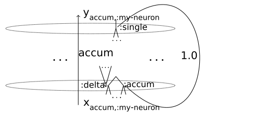

# Tutorial on self-transforming neural machines

## Basics of self-modifying neural machines

Neural machines work by repeating a two-stroke cycle. 
The inner mechanisms of neurons work during the first phase of the cycle.
Then the network connectivity matrix remixes the neuron outputs with weights
and creates neuron inputs for the next cycle during the second phase of the cycle.

To allow the neural machine to modify its own connectivity matrix,
we create a dedicated neuron _Self_ which emits a new network connectivity matrix on each step
during the first phase of each cycle
(or it might emit a more complex structure which contains the connectivity matrix).
This newly created connectivity matrix is used during the second phase of the same cycle.

The newly created connectivity matrix is just one of the neuron outputs, so
along with other neuron outputs it gets remixed during the second phase (yes, this is
an example of self-application) to create neuron inputs for the next cycle.

This allows the network to analyze its own connectivity and to use its own
connectivity structure in various ways, in addition to using it directly
during the second phase of a two-stroke cycle.

### _Self_ is typically an accumulator

We usually connect the output of _Self_ containing the connectivity matrix with one of
its inputs with weight 1. This way _Self_ accumulates the connectivity matrix while
accepting updates to its value from other neurons in the network.

Figure 5, _Accumulator of updates_, in Section 6 of https://arxiv.org/abs/1712.07447 (_Dataflow Matrix Machines and V-values: a Bridge between Programs and Neural Nets_).

The "_Self_ as an accumulator" pattern is not the mandatory  (in principle, one can imagine different arrangements, 
where _Self_ is not an accumulator, but something else,
and if some accumulation is needed it is always possible to situate it upstream of _Self_). 

But we were using "_Self_ as an accumulator" pattern in our 2016-2018 experiments.

### Unlimited dynamic self-expansion

In some of our experiments we allowed unlimited dynamic self-expansion of the network.

To do this one imagines having "an ambient infinite collection of silent neurons
which don't take any memory or computational resources, but only exist as abstract
entities in the infinite address space". Under this approach, the connectivity matrix
is infinite, but it contains only a finite number of non-zero elements (so the connectivity matrix becomes
an inherently sparse matrix).

When a neuron acquires a non-zero connection within the connectivity matrix,
this neuron stops being silent and is no longer just an abstract entity, but
it gets allocated in the computer memory, and computational resources are now spent on
computing its inputs and outputs. Such neuron is called _active_.

## A simple scenario for self-expansion

We start with two active neurons and with the connectivity matrix containing
two non-zero elements.

One of this active neurons is _Self_, and one of the two non-zero elements
of the connectivity matrix is weight 1, connecting the output of _Self_ to one of its inputs.

Another active neuron is _Update_, and the second non-zero element of
the connectivity matrix is weight 1, connecting the output of _Update_
to one of the inputs of _Self_.

During the first phase of the two-stroke cycle, _Self_ combines its inputs
together creating a new connectivity matrix.

What is happening under this scenario depends on the specific
updates to the connectivity matrix emitted by the neuron _Update_.

When the connectivity matrix emitted by _Self_ contains new non-zero
elements, more neurons become active as necessary.

### Live-coding scenario

In the livecoding scenario, the _Update_ neuron listens for matrix
updates on an asynchronous channel. If it does not hear anything,
it emits zero value corresponding to "no update" action. If it receives
an update for the network connectivity matrix, it passes this update
to _Self_ to be incorporated into the connectivity matrix.

## V-values and variadic neurons

Our experiments which edit a running network on the fly by sending it requests to edit itself;
Section 1.1 of our [dmm-notes-2018](https://www.cs.brandeis.edu/~bukatin/dmm-notes-2018.pdf)
use streams of V-values and variadic neurons.

Standard neural net neurons have one output and one input (accumulating one linear combination
of the outputs of other neurons). It is often convenient to have more that one input and one
output (e.g. one might want a neuron to multiply two inputs, or one might want a neuron to
produce a couple of complementary outputs). We decided that it would be most convenient to
have an unlimited number of inputs and outputs per each neuron. To achieve that, we consider neurons processing a dictionary containing all
inputs and producing a dictionary containing all outputs.

Figure 4 in Section 4, _Variadic Neurons_, of https://arxiv.org/abs/1712.07447 (_Dataflow Matrix Machines and V-values: a Bridge between Programs and Neural Nets_).

When one has unlimited number of inputs and outputs, it is convenient for all those inputs and outputs to be of the same kind, 
and so one would like to pick a sufficiently universal kind to
cover a variety of needs.

We choose nested dictionaries with numbers as their final values, that is, we choose
trees with numerical leaves, and we call them V-values,
as a shorthand for "vector-like values" and as a homage for S-expressions.

Figure 3 in Section 3, _V-values_, of https://arxiv.org/abs/1712.07447 (_Dataflow Matrix Machines and V-values: a Bridge between Programs and Neural Nets_).

This way all inputs of a neuron can be combined into a single V-value, and all outputs of a neuron
can be combined into a single V-value, and so the inner mechanism of a variadic neuron transforms
a single V-value into a single V-value. The "activation function" of a variadic neuron takes
a V-value as its argument and produces a V-value as its result. The actual inputs and outputs of the neuron
are the first-level subtrees of those V-values.

V-values are very flexible and serve various needs (convenient data structures for programming, hierarchies, and so on).

In particular, they contain all conventional tensors. The leaves on the first level of the tree can
be considered to be elements of a sparse vector, the leaves on the second level of the tree can
be considered to be elements of a sparse matrix (a sparse tensor of rank two),
the leaves on the third level of the tree can be considered to be elements of
a sparse tensor of rank three, etc.

For technical reasons, with variadic neurons it is often convenient to express "network connectivity matrix"
not as a usual tensor of rank 2, but as a tensor of a higher rank (because it is often convenient to
allow hierarchical indices of rows and columns of a matrix). V-values are expressive enough to easily provide
this functionality.

### Live-coding with V-values and variadic neurons

With variadic neurons, it is convenient to use the _Update_ neuron to inject changes into multiple
places in the network.

For example, our experiments which edit a running network on the fly by sending it requests to edit itself,
Section 1.1 of our [dmm-notes-2018](https://www.cs.brandeis.edu/~bukatin/dmm-notes-2018.pdf), start with
the dedicated `:direct` output of the _Update_ neuron connected to the `:delta` input of the _Self_ neuron.

Then we can use this connection from _Update_.`output:direct` to _Self_.`input:delta` to edit the network 
connectivity matrix and link some other outputs of the _Update_ neuron to other inputs in the network.

For example, in that particular experiment we link `:to-test-image` output of the _Update_ neuron
to the `:delta` input of the _Test-Image_ neuron. We also link one of the outputs of the
_Test-Image_ neuron to one of its inputs with weight 1 making it an accumulator.

This interactive change of the connectivity matrix of the running network makes the _Test-Image_ neuron active,
so the active part of the network is expanded to include _Test-Image_. Then we send 
`:to-test-image IMAGE-DATA` to the _Update_ neuron, and this leads to `IMAGE-DATA` being send
to the `:delta` input of the _Test-Image_ neuron and being stored in the _Test-Image_ accumulator.

It is somewhat more difficult and less intuitive than I'd like it to be. All these experiments involving
live-coding with variadic neurons are recorded here

https://github.com/jsa-aerial/DMM/tree/master/examples/dmm/quil-controlled/interactive

and the particular experiment with the _Test-Image_ neuron is recorded here:

https://github.com/jsa-aerial/DMM/blob/master/examples/dmm/quil-controlled/interactive/comment_to_april_2018_experiments.md

---

The `nu-general` function which sends data to update the network using 
arbitrary output of the update neuron is useful in this context.
Different outputs can be connected to different accumulator neurons, e.g.

`(nu [v-accum :test-image :accum] [v-accum :test-image :single] 1)`

`(nu [v-accum :test-image :delta] [v-network-update-monitor :network-interactive-updater :to-test-image] 1)`

`(nu-general :test-image :to-test-image)`

Here we use `:to-test-image` output of the update neuron, whereas the `nu` function
uses `:direct` output of the update neuron.

---

I'd like to ponder how to make this more transparent and intuitive, and also more general, returning to this new
December 2019 remark and making it a goal for the next iteration of this project:

_This enables live-coding, but this is also quite open-ended, since it enables a population of networks to tell each other to modify themselves; of course, the receiving network doesn’t have to follow an incoming instruction to self-modify blindly, although in the most simple-minded case it would do so._

## We cheated a bit

We said in the beginning:

"Neural machines work by repeating a two-stroke cycle. 
The inner mechanisms of neurons work during the first phase of the cycle.
Then the network connectivity matrix remixes the neuron outputs with weights
and creates neuron inputs for the next cycle during the second phase of the cycle."

In reality, it is convenient to start with the second phase: one sets up the
connectivity matrix (and all initial neuron outputs as necessary),
and performs the second phase, then invokes the inner mechanisms of neurons
(the first phase). 

The reason for this is two-fold. First, we would like to be able to have neurons without
neural inputs, and we would like to be able to initialize their outputs (which can be
used as constant data). More importantly, the network matrix determines which neurons are
active in the setup allowing for dynamic self-expansion. And so, we need to know the
network matrix before knowing which neurons are active and thus need to perform their
internal computations. So one starts with knowing the network matrix and all the neuron
outputs, applies the network matrix to the set of neuron outputs to obtain all the neuron
inputs, and only then the internal computations of active neurons get invoked.
